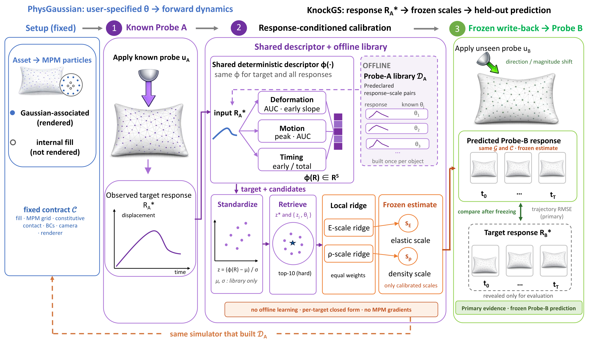
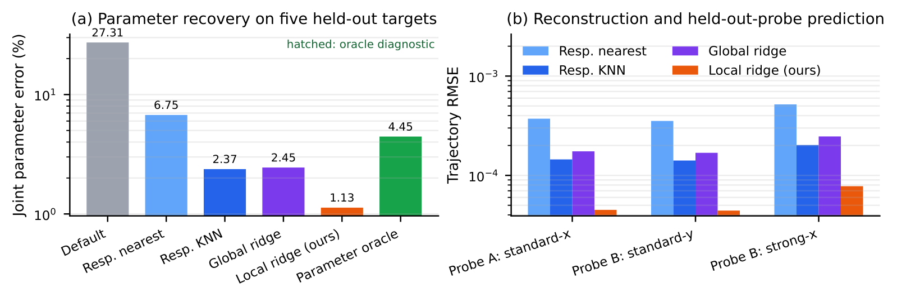
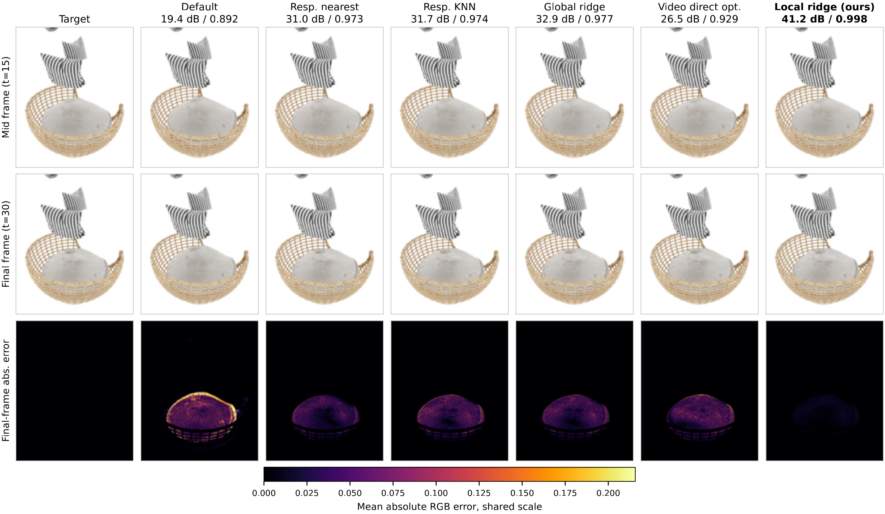
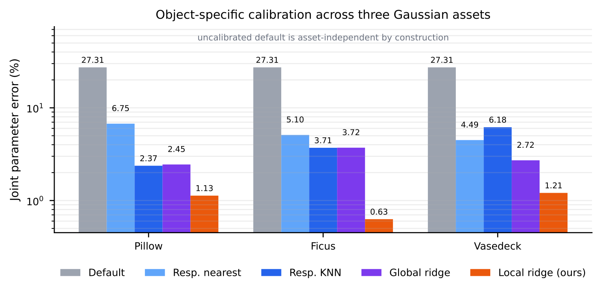

# KnockGS

<p align="center">
  <b>Interaction-Grounded Calibration of Physical Gaussian Representations</b>
</p>

<p align="center">
  Chenchen Ge<sup>*</sup>, Hanwen Shen<sup>*</sup>, Bowen Jing, Jiyuan Cai, Xiaofeng Wang,<br>
  Hongsen Lei, Weitao Zhou, Dandan Zhang, Haibao Yu<sup>&dagger;</sup>
</p>

<p align="center">
  <sup>*</sup>Equal contribution &nbsp;&nbsp; <sup>&dagger;</sup>Corresponding author
</p>

<p align="center">
  <a href="https://arxiv.org/abs/2608.27365"><b>arXiv</b></a> |
  <a href="https://arxiv.org/pdf/2608.27365"><b>Paper</b></a>
</p>

KnockGS calibrates the effective elasticity and density scales of a physics-integrated 3D Gaussian asset from its response to a known interaction. The estimated scales are frozen, written back into the same simulator, and evaluated by predicting the response to a different, held-out interaction.

<p align="center">
  
</p>

## Highlights

- **Interaction-grounded calibration.** KnockGS turns the response to a known Probe A into physical evidence for estimating elasticity and density scales.
- **Simple response-space estimator.** A shared deterministic descriptor, candidate-only standardization, hard top-k retrieval, and local ridge regression produce continuous material estimates without MPM gradients.
- **Frozen cross-interaction prediction.** The estimate is frozen before Probe B and evaluated on interactions that differ in direction, magnitude, or both.
- **Object-specific but reusable.** The Probe-A response library is built once for a fixed Gaussian asset and simulator contract, then reused across target calibrations.

The candidate-library size is denoted by `J` and is not fixed by the method. The main paper benchmark uses `J = 54`, while the supplementary study also evaluates smaller libraries.

## Results

Across five held-out Pillow targets, local ridge reduces mean joint scale error to **1.13%**, compared with **2.37%** for response KNN and **2.45%** for global ridge under the same Probe-A evidence. The frozen estimate also yields the lowest trajectory error under the held-out direction- and magnitude-shifted probes.

<p align="center">
  
</p>

The rendered comparison follows the same ordering. On the illustrated unseen Probe-B sequence, KnockGS reaches **41.2 dB PSNR** and **0.998 SSIM**, with the smallest final-frame absolute error.

<p align="center">
  
</p>

The same object-specific calibration procedure is evaluated on three geometrically distinct Gaussian assets: Pillow, Ficus, and Vasedeck.

<p align="center">
  
</p>

## Citation

If you find KnockGS useful, please cite:

```bibtex
@article{ge2026knockgs,
  title         = {KnockGS: Interaction-Grounded Calibration of Physical Gaussian Representations},
  author        = {Ge, Chenchen and Shen, Hanwen and Jing, Bowen and Cai, Jiyuan and Wang, Xiaofeng and Lei, Hongsen and Zhou, Weitao and Zhang, Dandan and Yu, Haibao},
  journal       = {arXiv preprint arXiv:2608.27365},
  year          = {2026},
  eprint        = {2608.27365},
  archivePrefix = {arXiv},
  primaryClass  = {cs.CV},
  url           = {https://arxiv.org/abs/2608.27365}
}
```

## Acknowledgments

KnockGS is built on [PhysGaussian](https://github.com/XPandora/PhysGaussian), [3D Gaussian Splatting](https://github.com/graphdeco-inria/gaussian-splatting), and [Warp-MPM](https://github.com/zeshunzong/warp-mpm). We thank the authors for releasing their work.
